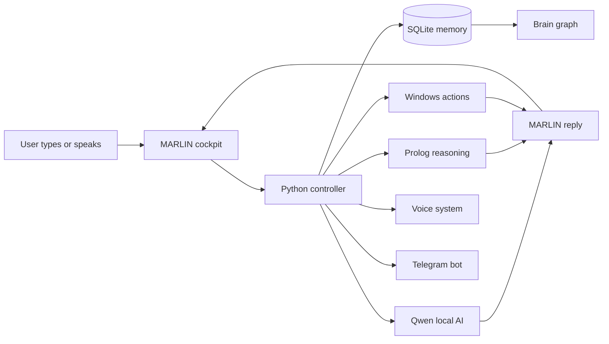
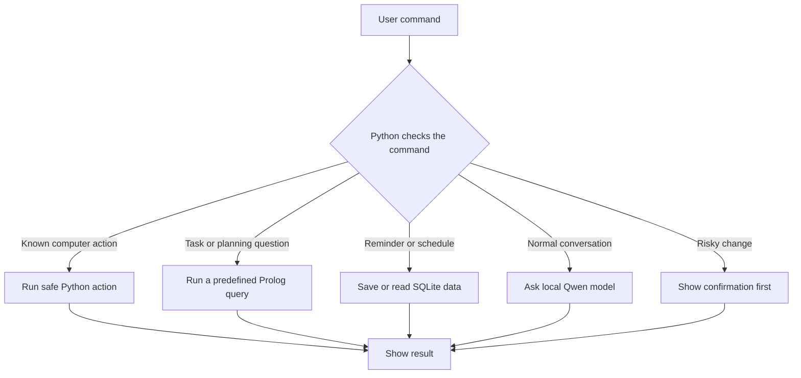

# MARLIN Project - Easy Guide

## 1. What Is MARLIN?

MARLIN is a personal AI assistant for a Windows laptop.

It is designed to:

- talk with the user;
- listen for English voice commands;
- open files, folders, applications, websites, and media;
- remember useful information;
- manage reminders and schedules;
- show projects as a visual brain graph;
- use Prolog rules to make logical decisions;
- receive safe remote commands through Telegram.

MARLIN is more than a chatbot. It can **talk, remember, reason, and perform safe actions**.

## 2. The Project in One Picture



**Important:** Python is the central controller. The AI model cannot directly run shell commands or freely control the laptop.

## 3. Main Technologies

| Part | Technology | Simple meaning |
|---|---|---|
| Main program | Python | Connects and controls every part |
| Conversation | Qwen3 4B Instruct with Ollama | Produces normal AI replies locally |
| Logical reasoning | SWI-Prolog and PySWIP | Applies facts and rules |
| Memory | SQLite and FTS5 | Stores knowledge and searches files |
| Desktop interface | HTML, CSS, JavaScript, FastAPI, pywebview | Shows the MARLIN cockpit |
| Speech recognition | Faster-Whisper | Changes English speech into text |
| Wake phrase | Vosk | Detects "Hey MARLIN" |
| Spoken reply | Piper | Reads English replies aloud |
| Remote control | Telegram Bot API | Sends approved remote commands |
| Knowledge view | Interactive force graph | Shows projects, folders, files, and links |

## 4. How MARLIN Handles a Command



Examples:

- `open Chrome` uses a Python computer action.
- `play relaxing music on YouTube` uses MARLIN's YouTube player.
- `high priority tasks` uses Prolog.
- `remind me tomorrow at 9 AM` saves a reminder in SQLite.
- `hello MARLIN` uses the local Qwen conversation model.
- A destructive file change requires confirmation.

## 5. Functions Working Now

The following functions are implemented and covered by the project's automated tests.

### Desktop and Command Centre

- Start the cockpit with `py main.py`.
- Use typed commands in the command bar.
- Move interface panels around the screen.
- View live status, replies, reminders, schedules, Prolog activity, and Telegram state.
- Run browser mode with `py main.py serve`.
- Run terminal mode with `py main.py terminal`.
- Turn MARLIN off with a supported close or shutdown command.

### Local AI Conversation

- Chat with the local Qwen model through Ollama.
- Keep recent conversation context for follow-up questions.
- Route known commands before calling the model for faster actions.
- Continue local computer and Prolog commands if Ollama is unavailable.

### English Voice

- Listen through the selected or system-default microphone.
- Convert English speech to text with Faster-Whisper.
- Detect the wake phrase `Hey MARLIN` with Vosk.
- Speak English replies using the local Piper voice.
- Stop current and queued speech.
- Show listening, transcribing, thinking, and speaking states.

### Computer Actions

- Open installed applications, including common apps such as Chrome, VS Code, Canva, Edge, Firefox, Notepad, Calculator, Explorer, Discord, and Telegram.
- Discover additional applications from Windows shortcuts and registered applications.
- Open files and folders.
- Open websites.
- Open and close the Windows Camera app only after an explicit camera command.
- Play local video files.
- Search YouTube and start music or video playback.
- Pause, resume, skip, mute, and change Windows volume.
- Lock the Windows computer.
- Close supported applications with confirmation.
- Block arbitrary PowerShell, CMD, and shell execution.

### Files and Brain Graph

- Index project files and selected user folders.
- Search filenames and short text snippets with SQLite FTS5.
- Extract safe text from source code, text, Markdown, JSON, YAML, CSV, PDF, and DOCX files.
- Skip protected, hidden, unreadable, dependency, cache, and oversized content.
- Show `C:\Projects\Projects` as an interactive graph.
- Display main projects with larger nodes and stable colours.
- Drag, pan, zoom, select, and highlight graph relationships.
- Explain projects, related files, technologies, imports, and possible file-change impact.

### Memory and Preferences

- Store recent projects, files, applications, actions, and conversation references.
- Learn clear preferences such as `I prefer coding in the morning`.
- List remembered preferences.
- Correct or forget a preference.
- Reject sensitive preference data such as passwords and API keys.

### Reminders and Scheduling

- Create, display, complete, and snooze reminders.
- Create alarms and play local notification sounds.
- Keep reminders in SQLite across restarts.
- Show reminders in a timeline in the cockpit.
- Create schedule tasks and fixed events.
- Preview a daily plan before saving it.
- Apply or discard a schedule plan.
- Find schedule conflicts.
- Use Prolog CLP(FD) constraints for valid time slots.
- Use the Windows reminder runner when it is installed.

### Prolog Reasoning

- Find important and high-priority tasks.
- Explain why a task is high priority.
- Identify overdue and blocked tasks.
- Reason about task dependencies.
- Recommend a next task.
- Plan non-overlapping schedule blocks.
- Reason about related files and change impact.
- Include user preferences in recommendations.
- Rank saved web evidence using predefined rules.
- Display the predicate, facts, matched rules, result, and explanation in the Prolog Activity panel.

### Internet Research

- Search the public internet only after an explicit research command.
- Use keyless Bing or DuckDuckGo search methods.
- Inspect a limited number of safe public pages.
- Block localhost, private network addresses, downloads, and oversized pages.
- Save titles, links, dates, and short notes instead of entire websites.
- Show source links and a short summary.

### Telegram

- Pair one private Telegram owner using a one-use code.
- Remove the owner locally from the cockpit or terminal.
- Show tappable Apps, Media, Camera, and Files controls.
- Remotely open approved apps and folders.
- Control media, volume, camera, and computer lock.
- View status, reminders, schedule, priority tasks, graph summaries, file search, and research.
- Prepare messages for approved contacts.
- Require the owner to approve a message before it is sent.
- Reject commands from unknown users.
- Record Telegram actions in the local audit history.

## 6. Functions That Need Local Setup

These functions are implemented, but they only work when their required software or model is installed.

| Function | Requirement |
|---|---|
| AI conversation | Ollama running with `qwen3:4b-instruct` |
| Prolog reasoning | SWI-Prolog and PySWIP |
| Voice transcription | Working microphone and Faster-Whisper model |
| Wake phrase | Downloaded Vosk model |
| Spoken response | Downloaded Piper voice model |
| Native desktop window | pywebview and its Windows runtime |
| Background reminders | Registered Windows reminder task |
| Telegram controls | Internet, BotFather token, and paired owner |
| Internet research | Internet connection and accessible public search pages |

Check the laptop with:

```powershell
py main.py doctor
```

Install or prepare local dependencies with:

```powershell
py main.py setup
```

## 7. What Prolog Does

Prolog is MARLIN's **logical decision maker**.

SQLite stores facts such as:

- this is a task;
- the task is urgent;
- the task is unfinished;
- the task belongs to an active project;
- another task must be completed first.

Prolog applies rules to those facts.

```prolog
high_priority(Task) :-
    task(Task),
    urgent(Task),
    not_completed(Task),
    belongs_to(Task, Project),
    active_project(Project).
```

If every condition is true, Prolog concludes that the task is high priority. It can also return the facts and rules that caused the decision. This is easier to explain and test than asking the language model to guess.

Python only allows predefined Prolog queries. The user or AI model cannot send arbitrary Prolog code.

## 8. Data and Privacy

- The main database is stored locally in SQLite.
- The cockpit binds to `127.0.0.1`, not the public internet.
- Ollama, Prolog, Whisper, Vosk, and Piper run locally.
- Telegram and internet research are optional online features.
- Bot tokens belong only in the ignored `.env` file.
- MARLIN does not store passwords, API keys, or private messages as preferences.
- Protected Windows locations and arbitrary shell commands are blocked.
- Risky file changes and application closing require confirmation.

## 9. Useful Commands

```powershell
# Start the desktop cockpit
py main.py

# Check MARLIN's dependencies
py main.py doctor

# Start terminal mode
py main.py terminal

# Start voice mode
py main.py voice

# Start browser cockpit mode
py main.py serve

# Ask one command
py main.py ask "high priority tasks"

# Test Prolog reasoning
py main.py reason high-priority
py main.py reason why-high-priority task_finish_graph_interface

# Telegram setup
py main.py telegram pair
py main.py telegram status
py main.py telegram unpair

# Run all automated tests
py -m pytest -q
```

## 10. Current Limits

- Voice conversation is turn-taking, not true full-duplex conversation like a phone call.
- A small local model can be slower and misunderstand more often than a large cloud model.
- App control depends on Windows being able to find the application or shortcut.
- Website control is focused on supported actions; it is not unrestricted browser automation.
- Internet research can fail when a website blocks automated access.
- MARLIN does not send email, use banking services, or execute arbitrary terminal commands.
- The project is English-first. Burmese voice support was removed for speed and reliability.
- Telegram interactive commands need MARLIN to be running.

## 11. Future Plan

### Phase 1 - Reliability and Speed

- Reduce voice response delay further.
- Improve microphone endpoint detection and accented-English recognition.
- Add stronger interruption while MARLIN is speaking.
- Improve local model selection for the best balance of speed and quality.
- Add a simple Windows installer and automatic dependency repair.

### Phase 2 - Smarter Knowledge

- Add semantic or vector search for meaning-based file discovery.
- Create better file summaries and project reports.
- Add richer graph filters, clustering, and timelines.
- Improve long-term conversation memory with user-controlled retention.
- Add more explainable Prolog rules for deadlines, risk, and project planning.

### Phase 3 - More Useful Integrations

- Add optional calendar and email connections with clear permissions.
- Add more messaging services such as Discord.
- Add browser workflows for selected trusted websites.
- Add optional phone access through a secure private connection.
- Add contact, notification, and briefing preferences.

### Phase 4 - Advanced Assistant Experience

- Add computer vision for user-approved screen or camera understanding.
- Add true low-latency, interruptible voice conversation.
- Support more languages after reliable local speech models are available.
- Add multiple specialised agents for research, planning, files, and coding.
- Add encrypted backups and user profiles.

## 12. Six-Member Presentation Split

| Member | Topic | What to explain |
|---|---|---|
| 1 | Problem and objective | Why MARLIN was created and what problem it solves |
| 2 | System architecture | How Python routes commands to AI, Prolog, SQLite, and Windows |
| 3 | AI and voice | Qwen, Ollama, Whisper, Vosk, and Piper |
| 4 | Database and graph | SQLite memory, file indexing, and the project brain graph |
| 5 | Prolog | Facts, rules, priority reasoning, scheduling, and explanations |
| 6 | Actions and demonstration | Apps, camera, media, reminders, Telegram, safety, and live demo |

## 13. Simple Live Demonstration

1. Run `py main.py`.
2. Type `hello MARLIN` to show local AI conversation.
3. Type `open Chrome` to show a Python computer action.
4. Type `play relaxing music on YouTube` to show media control.
5. Type `remind me tomorrow at 9 AM to check my report`.
6. Open the reminder timeline to show local storage.
7. Type `high priority tasks` and open the Prolog Activity panel.
8. Ask `why high priority task_finish_graph_interface`.
9. Show the brain graph and explain projects, folders, files, and links.
10. Show the Telegram command menu as optional remote access.

## 14. Short Answer for a Teacher

> MARLIN is a local Windows AI assistant. Qwen handles conversation, Python controls safe actions, SQLite stores memory, Prolog performs rule-based reasoning, and the brain graph visualises project knowledge. It can listen, speak, remember, plan, explain decisions, manage files and reminders, control approved applications, and receive secure Telegram commands.

## 15. Project Status

- **Core project:** implemented.
- **Automated verification:** 208 tests passing on September 9, 2026.
- **Main interface:** `py main.py`.
- **Local-first operation:** supported.
- **Optional online parts:** Telegram and explicit internet research.
- **Continuing work:** voice speed, recognition quality, broader integrations, and advanced knowledge search.

