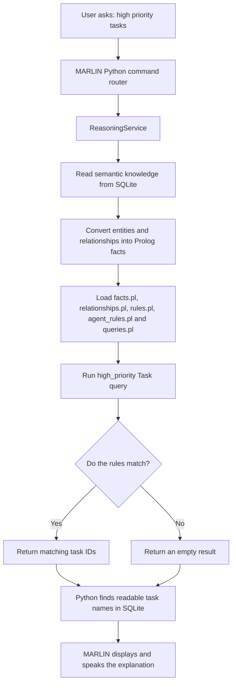
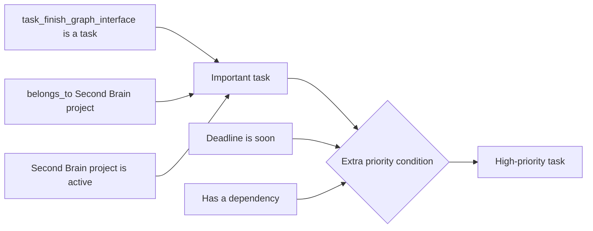
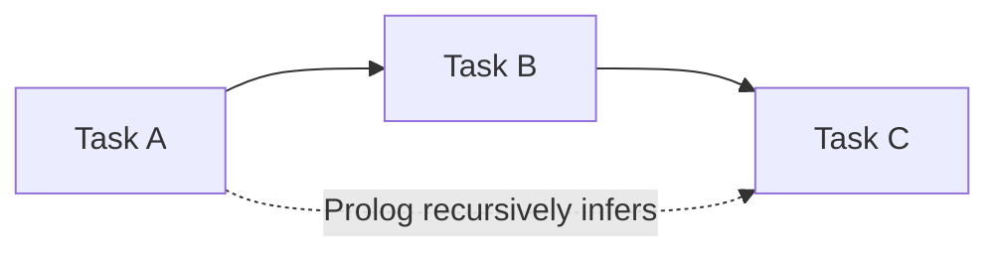
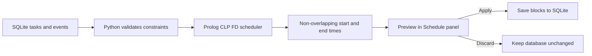
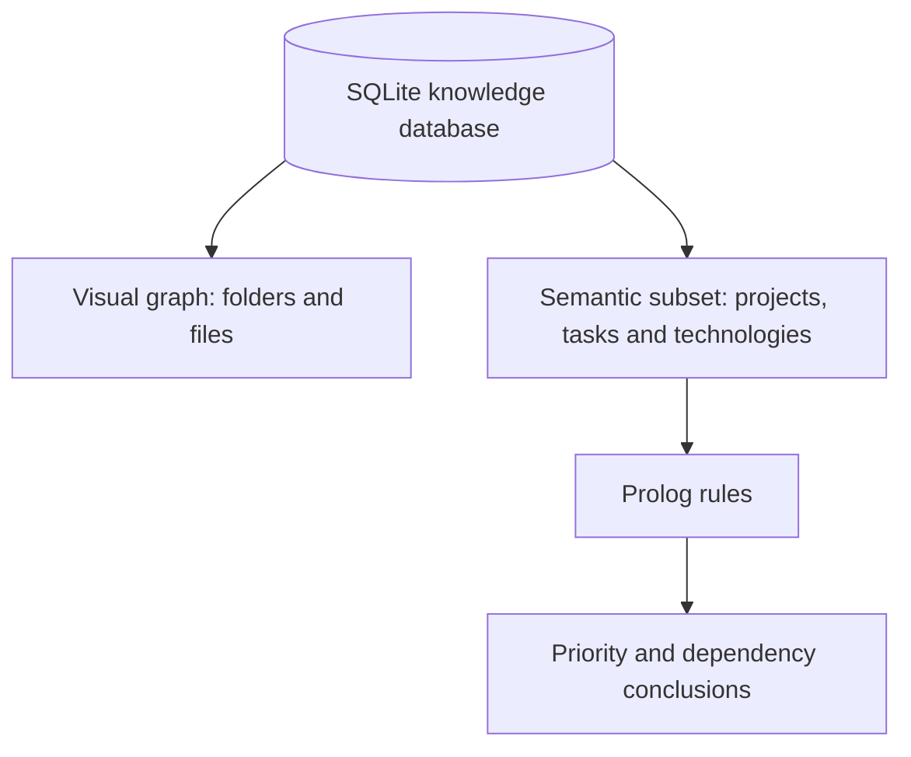

# How Prolog Works in MARLIN

## 1. Simple Explanation

Prolog is MARLIN's **rule-based reasoning engine**. SQLite stores the knowledge, Python controls the process, and Prolog decides what can be logically concluded from facts and rules.

For example, MARLIN can determine that a task is high priority when:

- it belongs to an active project; and
- its deadline is soon, or it has a dependency.

The local Qwen model is not used for this decision. Prolog produces the result from explicit rules, which makes the answer predictable and explainable.

## 2. Main Components

| Component | Role |
|---|---|
| SQLite | Permanently stores projects, tasks, technologies, metadata, and relationships |
| Python `KnowledgeService` | Reads entities and relationships from SQLite |
| Python `ReasoningService` | Coordinates the reasoning operation |
| PySWIP | Connects Python to SWI-Prolog |
| SWI-Prolog | Evaluates facts, relationships, and rules |
| MARLIN runtime | Recognises reasoning commands and displays the result |

## 3. Complete Reasoning Flow



## 4. Step-by-Step Operation

### Step 1: The user asks a reasoning question

Examples:

```text
high priority tasks
show high priority tasks and identify the Prolog activity
how did Prolog decide which tasks are high priority?
why high priority task_finish_graph_interface
```

MARLIN's deterministic command router detects these phrases in `marlin/runtime.py`. It sends them directly to the reasoning service instead of sending them to Ollama.

This makes Prolog commands faster and prevents the language model from inventing a logical result.

### Step 2: Python reads semantic knowledge from SQLite

`ReasoningService._synced_engine()` uses `KnowledgeService` to load:

- `project` entities;
- `task` entities;
- `technology` entities;
- `belongs_to` relationships;
- `depends_on` relationships; and
- `uses` relationships.

The knowledge remains permanently stored in SQLite. Prolog receives a temporary synchronised copy whenever reasoning is requested.

### Step 3: Python loads the Prolog program

`PrologEngine.load()` checks that SWI-Prolog and PySWIP are available. It then consults:

```prolog
:- consult('facts.pl').
:- consult('relationships.pl').
:- consult('rules.pl').
:- consult('agent_rules.pl').
:- consult('queries.pl').
```

The entry file is `prolog/reasoning.pl`.

### Step 4: Old temporary facts are cleared

Before each synchronisation, Python uses `retractall/1` to remove the previous in-memory facts. This prevents duplicated or outdated facts from affecting a new result.

Examples of cleared predicates include:

```prolog
retractall(project(_)).
retractall(task(_)).
retractall(active(_)).
retractall(deadline_soon(_)).
retractall(belongs_to(_, _)).
retractall(depends_on(_, _)).
```

This operation does **not** delete data from SQLite.

### Step 5: Python converts SQLite records into Prolog facts

Suppose SQLite contains:

- project: `project_second_brain`, active = true;
- task: `task_finish_graph_interface`, deadline soon = true;
- relationship: the task belongs to the project; and
- relationship: the task depends on the reasoning file.

Python asserts equivalent Prolog facts:

```prolog
project(project_second_brain).
active(project_second_brain).

task(task_finish_graph_interface).
deadline_soon(task_finish_graph_interface).

belongs_to(task_finish_graph_interface, project_second_brain).
depends_on(task_finish_graph_interface, file_reasoning_pl).
```

Only safe atom IDs matching lowercase letters, numbers, and underscores are accepted. Python rejects unsafe values before they reach Prolog.

### Step 6: Prolog applies the rules

The main rules are in `prolog/rules.pl`.

First, a project is active when it is both a project and marked active:

```prolog
active_project(Project) :-
    project(Project),
    active(Project).
```

A task is important when it belongs to an active project:

```prolog
important_task(Task) :-
    task(Task),
    belongs_to(Task, Project),
    active_project(Project).
```

A task becomes high priority through either of two rules:

```prolog
high_priority(Task) :-
    important_task(Task),
    deadline_soon(Task).


high_priority(Task) :-
    important_task(Task),
    depends_on(Task, _Dependency).
```

Therefore, `task_finish_graph_interface` is high priority because it belongs to an active project and also has a soon deadline or dependency.

### Step 7: Python runs a predefined query

For a high-priority request, Python runs only this allow-listed query:

```prolog
high_priority(Task)
```

Prolog tries to satisfy the rule from left to right:

1. Is the item a task?
2. Does it belong to a project?
3. Is that project active?
4. Is the deadline soon, or does the task have a dependency?

If all required conditions match, Prolog binds `Task` to the matching task ID.

### Step 8: Prolog returns task IDs

An example result is:

```text
Task = task_finish_graph_interface
```

`PrologEngine` converts the query rows into a unique sorted Python list.

### Step 9: Python creates a readable explanation

MARLIN also asks Prolog for reason predicates such as:

```prolog
high_priority_reason(task_finish_graph_interface, Reason)
```

Possible reason values are:

- `belongs_to_active_project`;
- `deadline_soon`;
- `important_task`; and
- `dependency`.

`ReasoningService` converts those symbolic values into sentences such as:

```text
Finish graph interface belongs to an active project.
Finish graph interface has a soon deadline.
The task depends on another knowledge item.
```

### Step 10: MARLIN presents the result

MARLIN returns structured information similar to:

```json
{
  "tasks": ["task_finish_graph_interface"],
  "prolog_activity": {
    "engine": "SWI-Prolog via PySWIP",
    "query": "high_priority(Task)",
    "facts_source": "SQLite projects, tasks, and relationships"
  }
}
```

The cockpit displays the readable response and publishes a `prolog.result` event so the interface can identify that Prolog was active.

## 5. High-Priority Example as a Logic Chain



In logic form:

```text
task
+ belongs to active project
= important task

important task
+ deadline soon OR dependency
= high-priority task
```

## 6. Other Prolog Functions in MARLIN

### Important tasks

```prolog
important_task(Task)
```

Finds tasks belonging to an active project.

### Blocked tasks

```prolog
blocked_task(Task)
```

Finds tasks with a `blocked` fact.

### Overdue tasks

```prolog
overdue_task(Task)
```

Finds tasks with an `overdue` fact.

### Dependency chains

```prolog
dependency_chain(Task, Dependency)
```

Uses recursion to find both direct and indirect dependencies.



### Current project focus

```prolog
current_project_focus(Project)
```

Selects an active focused project. If no project is explicitly focused, it can return active projects.

### Morning priorities

```prolog
morning_priority(Task)
```

Combines high-priority and overdue task rules for MARLIN's morning briefing.

### Intelligent day scheduling with CLP(FD)

Prolog is also MARLIN's constraint-based scheduler. `agent_rules.pl` imports
SWI-Prolog's `library(clpfd)` and represents times as integer minutes after
midnight. For example, `540` is 09:00 and `1080` is 18:00.

The main predicate is:

```prolog
schedule_tasks(Durations, Earliest, Latest, Busy, Starts, Ends)
```

It requires every task to fit inside its allowed time, finish after its full
duration, avoid other tasks, and avoid fixed appointments. Prolog then searches
for a valid set of start times.

Python adds deadlines, dependencies, working hours, priorities, and preferences
before invoking the predicate. MARLIN creates a preview first. SQLite changes
only when the user selects **Apply**.



Related predicates are `interval_conflict/4` and `dependency_order/3`.

### File relationship and impact reasoning

MARLIN sends relevant file candidates to Prolog instead of loading the entire
visual graph. `related_file/3` finds connections through imports, shared
concepts, and project membership. `file_change_impact/3` identifies direct and
transitive dependants. `stale_file/1` identifies files at least 180 days old.

For example, if `app.py` imports `config.py`, changing `config.py` may directly
affect `app.py`.

### Preference influence

Python converts active, non-sensitive preferences into temporary facts:

```prolog
preference_fact(preferred_period, morning, 90).
```

`preference_influences/3` uses preferences with at least 75 percent confidence.
MARLIN can therefore explain that it placed work in the morning because the
user prefers morning focus time.

### Internet evidence ranking

After an explicit internet search, Python supplies validated source metadata
and short claims. Prolog uses `source_quality/2`, `corroborated_source/3`,
`conflicting_source/3`, and `evidence_score/2`. The score rewards freshness,
domain diversity, search position, and agreement. Conflicting claims reduce the
score. Prolog does not browse; Python performs the safe search.

## 7. Current Prolog Function Map

| User request | Python method | Prolog predicate |
|---|---|---|
| High-priority tasks | `high_priority_tasks()` | `high_priority/1` |
| Why is this high priority? | `why_high_priority(id)` | `high_priority_reason/2` |
| Important tasks | `important_tasks()` | `important_task/1` |
| Blocked or overdue tasks | `blocked_tasks()` / `overdue_tasks()` | `blocked_task/1` / `overdue_task/1` |
| Current project | `current_project_focus()` | `current_project_focus/1` |
| Dependency chain | `dependency_chain(id)` | `dependency_chain/2` |
| Morning priorities | `morning_priorities()` | `morning_priority/1` |
| Plan my day | `plan_day_slots(...)` | `schedule_tasks/6` |
| Schedule conflicts | `intervals_conflict(...)` | `interval_conflict/4` |
| Related files | `related_file_reasons(id)` | `related_file/3` |
| File change impact | `file_change_impacts(id)` | `file_change_impact/3` |
| Preference effect | `preference_influences(id)` | `preference_influences/3` |
| Research ranking | `evidence_score(id)` | `evidence_score/2` |

## 8. Prolog and the Visual Brain Graph Are Different

The visual graph shows indexed folders and files under `C:\Projects\Projects`. It may contain thousands of nodes and relationships.

Prolog currently reasons over the smaller **semantic knowledge layer**:

- projects;
- tasks;
- technologies;
- active, focused, blocked, overdue, and deadline metadata; and
- `belongs_to`, `depends_on`, and `uses` relationships.

This separation is intentional. Sending every indexed file to Prolog on every query would be slow and would not improve the current task-priority rules.



## 9. Safety Design

Prolog does not receive unrestricted user-written queries.

- The user speaks or types a normal command.
- Python chooses a predefined method.
- Python validates entity IDs with `^[a-z][a-z0-9_]*$`.
- Only supported relationships are asserted.
- Prolog returns logical results only.
- Python remains responsible for computer actions.

Prolog cannot directly open applications, modify files, execute shell commands, or control Windows.

## 10. Required Software

The reasoning layer requires:

1. SWI-Prolog installed and available as `swipl`;
2. the Python `pyswip` package; and
3. MARLIN's files inside the `prolog/` directory.

Check the installation with:

```powershell
py main.py doctor
```

Run the reasoning command with:

```powershell
py -m second_brain.app.main reason high-priority
```

Run an explanation with:

```powershell
py -m second_brain.app.main reason why-high-priority task_finish_graph_interface
```

## 11. Important Source Files

| File | Responsibility |
|---|---|
| `prolog/facts.pl` | Declares dynamic entity and status facts |
| `prolog/relationships.pl` | Declares relationship facts |
| `prolog/rules.pl` | Contains priority, dependency, focus, and morning rules |
| `prolog/agent_rules.pl` | Contains scheduling, file, preference, and evidence rules |
| `prolog/queries.pl` | Provides named query wrappers |
| `prolog/reasoning.pl` | Loads the complete Prolog program |
| `second_brain/reasoning/prolog_engine.py` | Safe PySWIP bridge and predefined query methods |
| `second_brain/reasoning/service.py` | Synchronises SQLite knowledge and creates explanations |
| `marlin/runtime.py` | Routes user commands and publishes Prolog activity |
| `tests/test_prolog_reasoning.py` | Verifies the Prolog conclusions |

## 12. Short Answer for a Teacher

> Prolog is MARLIN's symbolic decision engine. SQLite permanently stores tasks,
> projects, files, preferences, schedules, and research metadata. Python validates
> selected facts and passes them to SWI-Prolog through PySWIP. Prolog applies
> explicit rules for task priority, dependencies, file impact, preference
> influence, evidence quality, and conflict-free scheduling with CLP(FD). It
> returns conclusions and reasons, while Python converts them into readable
> results and remains the only component allowed to execute actions.

## 13. How to Test Prolog

### Installation and bridge check

```powershell
py main.py doctor
```

Look for successful checks for `SWI-Prolog`, `pyswip`, and the
`Prolog Python bridge`.

### Test priority reasoning

```powershell
py main.py reason high-priority
py main.py reason why-high-priority task_finish_graph_interface
```

Inside the cockpit, ask:

```text
Show high priority tasks and identify the Prolog activity
Why high priority task_finish_graph_interface?
```

Open the **Prolog** panel to see the predicate, relevant facts, rules, result,
and proof information.

### Test scheduling

```text
Schedule my Prolog report before Friday
Plan my day
Show schedule conflicts
```

The first command stores a task. The second asks Prolog for valid slots. The
result stays a preview until **Apply** is selected.

### Run automated integration tests

```powershell
py -m pytest tests/test_prolog_reasoning.py tests/test_agent_expansion.py -q
```

### Test SWI-Prolog directly

```powershell
swipl -q -s prolog/reasoning.pl -g "interval_conflict(540,600,570,630),writeln(conflict),halt"
```

Expected output is `conflict` because 09:00-10:00 overlaps 09:30-10:30.

## 14. One-Minute Demonstration

1. Start MARLIN with `py main.py`.
2. Ask: `Show high priority tasks and identify the Prolog activity.`
3. Point out the `high_priority(Task)` query in the response.
4. Explain that facts came from SQLite.
5. Show that the task matched because its project is active and its deadline is soon or it has a dependency.
6. Ask: `Why high priority task_finish_graph_interface?`
7. Emphasise that Qwen handles conversation, while Prolog handles this rule-based conclusion.
