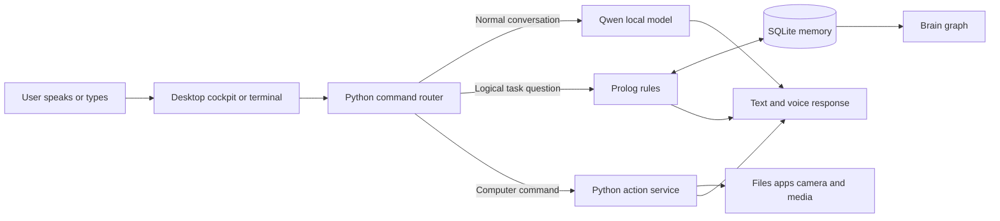
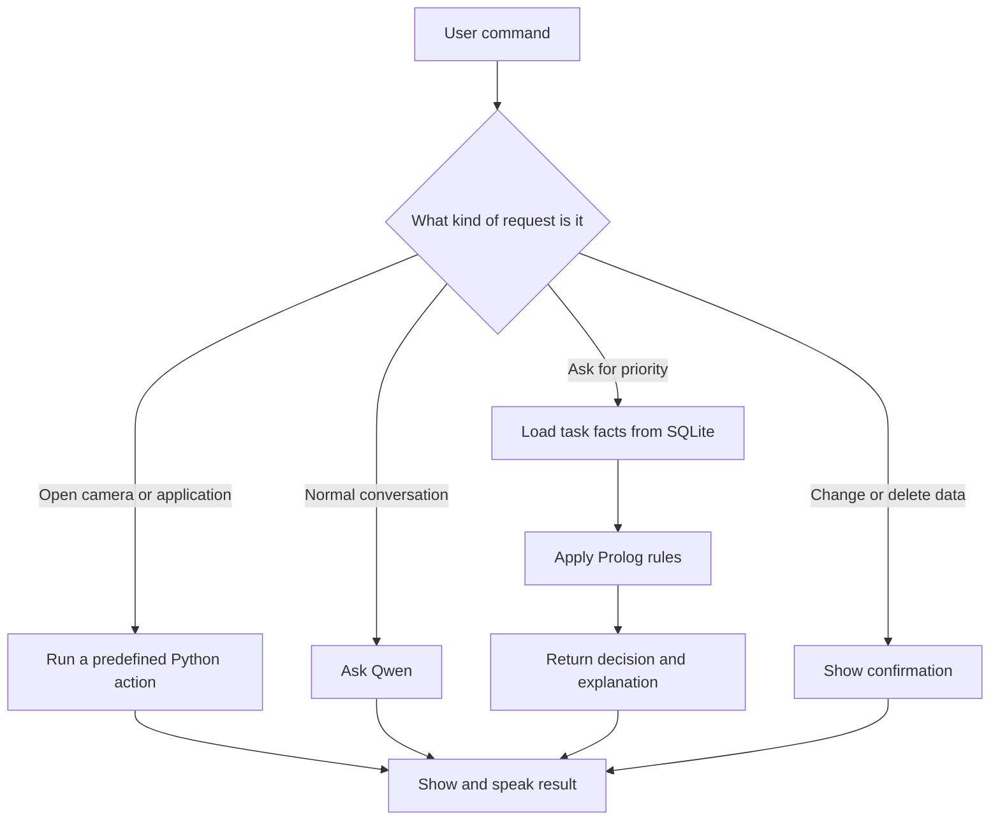

# MARLIN Local AI Assistant

## Easy Project Guide and Presentation Notes

MARLIN is a private personal AI assistant that runs on a Windows laptop. It can hold a conversation, listen for voice commands, open files and applications, manage reminders, display a visual knowledge graph, and use Prolog rules to recommend important tasks. Its core features work locally without a paid API key.

## The Main Idea

The easiest way to understand MARLIN is to compare it to a person:

| MARLIN part | Simple meaning | Technology |
|---|---|---|
| Conversation brain | Understands questions and writes replies | Qwen3 4B Instruct through Ollama |
| Body and controller | Performs actions on the laptop | Python |
| Long-term memory | Stores knowledge and history | SQLite |
| Logical thinker | Applies rules and explains decisions | SWI-Prolog and PySWIP |
| Eyes on knowledge | Displays projects and connections | Interactive brain graph |
| Ears | Converts speech into text | Faster-Whisper |
| Wake listener | Detects "Hey MARLIN" | Vosk |
| Voice | Reads English replies aloud | Piper |

## System Architecture



Python is the central controller. The language model does not receive unrestricted computer control. Python decides whether a request should use a direct action, Prolog, or Qwen.

## How a Command Is Processed



Examples:

- `open camera` goes directly to the Windows Camera action.
- `play C:\Videos\demo.mp4` opens the file in the default video player.
- `high priority tasks` loads facts and asks Prolog to apply priority rules.
- `hello MARLIN` is sent to the local Qwen model for conversation.
- `delete this file` requires confirmation before Python changes anything.

## What Prolog Does

Prolog is MARLIN's rule-based reasoning layer. It is used when the answer should follow clear logical rules rather than be guessed by the language model.

Example facts:

```prolog
task(task_report).
urgent(task_report).
belongs_to(task_report, project_marlin).
active_project(project_marlin).
not_completed(task_report).
```

Example rule:

```prolog
high_priority(Task) :-
    task(Task),
    urgent(Task),
    belongs_to(Task, Project),
    active_project(Project),
    not_completed(Task).
```

Conclusion: `task_report` is high priority because it is urgent, unfinished, and belongs to an active project. Python is the only component that adds facts or runs predefined Prolog queries.

## What the Brain Graph Shows

The graph visualises the indexed content under `C:\Projects\Projects`.

- Large coloured nodes represent main projects.
- Medium nodes represent folders.
- Small nodes represent files.
- Solid links represent folder containment.
- Cross-links connect folders that share file types.
- Dragging a node highlights its direct relationships.

The graph helps the user see project structure and connections that are difficult to notice in File Explorer.

## What MARLIN Can Do

- Talk through typed or English voice conversation.
- Wake when the user says "Hey MARLIN".
- Open accessible files, folders, websites, and installed applications.
- Close applications after confirmation to protect unsaved work.
- Open and close the Windows Camera app.
- Play local video files and YouTube media.
- Search indexed file names and short text snippets.
- Create files and folders and preview risky changes.
- Set, display, complete, and snooze reminders and alarms.
- Remember recent files, applications, projects, and conversation context.
- Display and explain the project knowledge graph.
- Use Prolog to find important, overdue, blocked, and high-priority tasks.

## Privacy and Safety

MARLIN binds its backend only to `127.0.0.1`, so the cockpit is available only on the local laptop. Qwen, Whisper, Vosk, Piper, SQLite, and Prolog run locally. Opening and reading are direct actions. Closing applications and changing, moving, replacing, or deleting files require confirmation because they can cause data loss. Arbitrary shell commands remain blocked.

## Six Member Presentation Split

1. **Member 1 - Problem and objective:** Explain why a personal local assistant is useful and introduce MARLIN.
2. **Member 2 - Architecture:** Explain the command router and how Python connects every component.
3. **Member 3 - Local AI and voice:** Explain Qwen, Ollama, Faster-Whisper, Vosk, and Piper.
4. **Member 4 - Database and brain graph:** Explain SQLite storage, indexing, projects, files, and relationships.
5. **Member 5 - Prolog reasoning:** Demonstrate facts, rules, high-priority tasks, and explanations.
6. **Member 6 - Computer actions and demonstration:** Show camera, applications, video, reminders, safety, and the final result.

## Suggested Live Demonstration

1. Run `py main.py` and show the desktop cockpit.
2. Say or type `open camera`.
3. Type `explain my graph` and show the graph response.
4. Type `high priority tasks` and identify the Prolog activity.
5. Open a file or application with a natural command.
6. Set a reminder and show where it is stored.
7. Finish with `turn yourself off` to demonstrate full lifecycle control.

## Short Presentation Summary

MARLIN is a fully local Windows AI assistant. Qwen handles conversation, Python controls actions, SQLite stores memory, Prolog performs logical reasoning, and the brain graph visualises project knowledge. This design makes MARLIN more than a chatbot: it can understand, reason, remember, explain, and perform real computer tasks while protecting risky operations.
